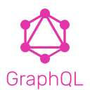

#  Hi there, I'm Akhila C R

  
I'm a ✨ full stack / front end ✨ developer and a computer science engineer. I love all things tech!

:sunflower: I'm currently working on **React.js** projects.

:seedling: I'm currently learning **full stack web development.**

:dancers: I’m looking to collaborate on **full stack projects**

## **:star2: Technologies and Tools**

## **:coffee: Reach me at**

